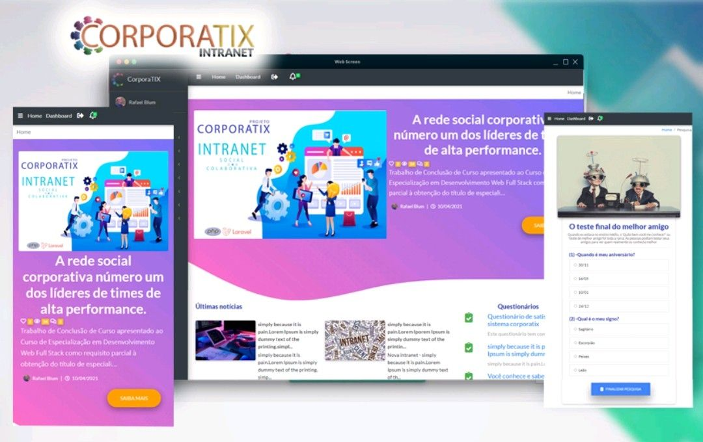

## Projeto Corporatix intranet social e colaborativa 2021

O objetivo deste trabalho será o desenvolvimento de um sistema de intranet social e colaborativa, que possa integrar, informar, satisfazer e engajar mais os colaboradores, favorecendo os interesses da empresa, centralizando a comunicação, divulgando conteúdos, compartilhando dúvidas e informações do que acontece no dia a dia de todos que fazem parte da empresa.

- .
- .
- .
- .
- .
- .

Laravel is accessible, powerful, and provides tools required for large, robust applications.

